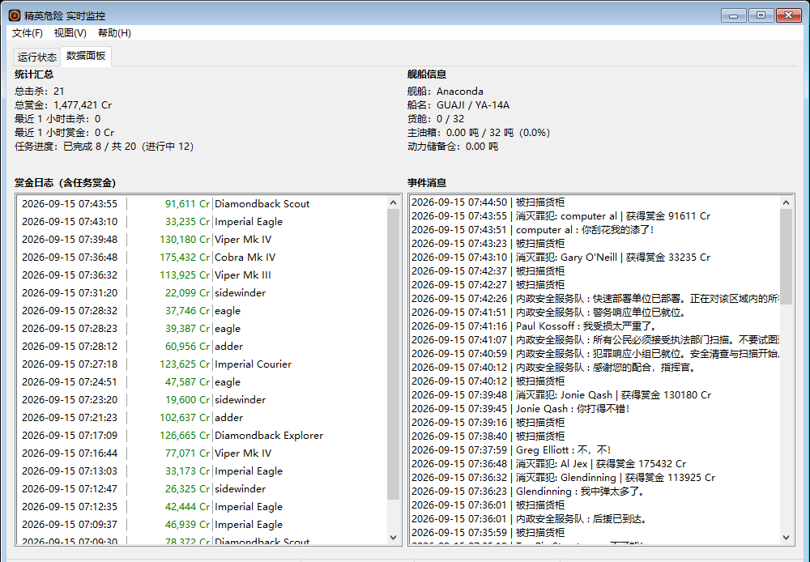
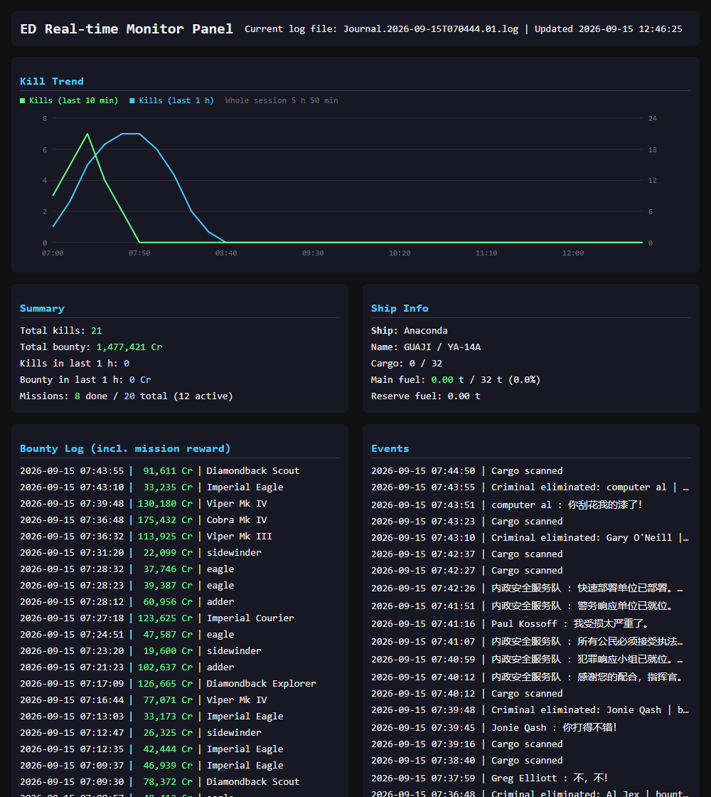
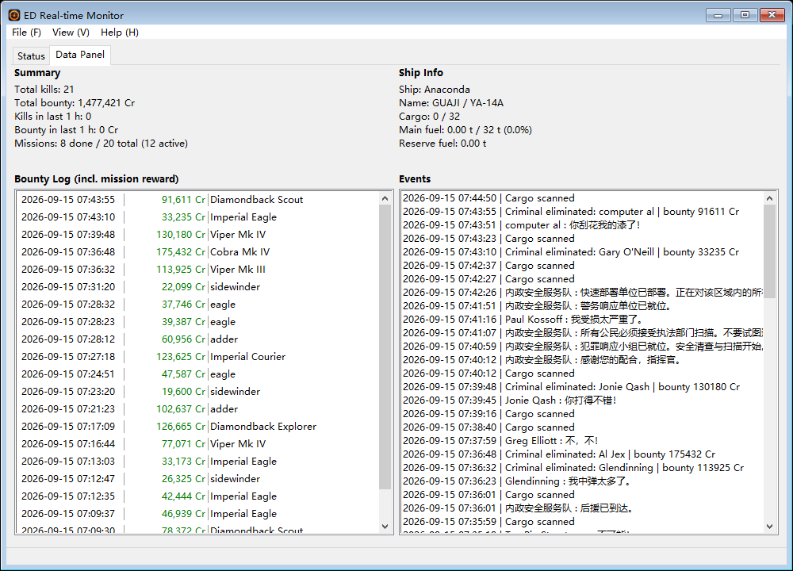
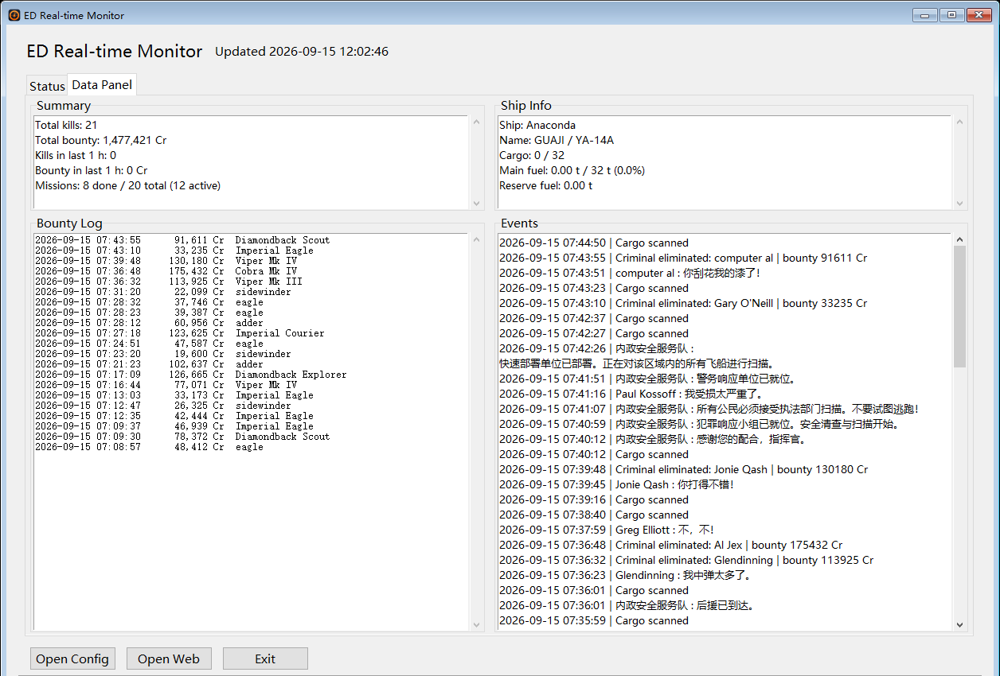

# 精英危险 日志监控

**中文说明** · [English](README.md)

一个自包含的《精英危险》桌面监控小工具。它跟随游戏的 Journal 日志，把它变成你在游戏时
（以及**不在**游戏时）真正需要的三件事：

- **击杀与赏金统计**——总击杀、总赏金、滚动窗口、任务赏金。
- **掉盾告警**——护盾被打掉的瞬间，经 [WxPusher](https://wxpusher.zjiecode.com) 推送提醒。
- **日志静默告警**——挂机时如果日志不再增长，多半是游戏掉线了。你会收到提醒，而不是
  几小时后才发现。
- **外加一个网页面板**——手机或局域网内另一台电脑都能打开：实时状态、击杀趋势图、
  赏金日志、原始事件流。



## 功能

| | |
|---|---|
| **统计** | 总击杀与总赏金、「最近 N」窗口、逐条赏金日志、任务赏金拆分、击杀趋势图（近期速率与最近 1 小时，统一按「杀/时」画在同一坐标轴上）、本局汇总 |
| **告警** | 掉盾与日志静默，经 [WxPusher](https://wxpusher.zjiecode.com) 推送提醒——第三方推送服务，非微信官方接口。静默提醒有次数上限，整夜掉线不会持续刷屏 |
| **舰船信息** | 当前舰船、船名/编号、货舱、主油箱与储备仓——当前日志还没有 `Loadout` 事件时，会从历史日志补齐 |
| **网页面板** | 实时状态、趋势图（内联 SVG）、赏金日志、事件流。局域网可访问、gzip 压缩、无构建步骤、不依赖 CDN |
| **状态栏** | 一眼看完，不用切页签：HTTP 状态、**可点击的面板地址**（点击即在浏览器打开）、总击杀、近 1 小时击杀、任务进度、总赏金——Win32 与 Tk 两版分段一致 |
| **边缘工具条** *（仅 Win32）* | 关闭或最小化时，窗口收成一条贴屏幕底边的圆角窄条，仍实时显示状态行。**按住可拖**到任意位置，**双击**恢复主窗口，右键出托盘菜单（`toolbar_edge`） |
| **中英双语界面** | 默认跟随系统区域自动切换，也可在配置里写死。翻译放在可编辑的 TOML 文件里，加一门语言**不需要重新编译** |
| **自包含** | 单文件可执行程序。无需安装器、无运行时依赖、无 DLL、**无 CGO**——Tk 版把 Tcl/Tk 9.0 以纯 Go 形式内嵌 |
| **配置可编辑** | 程序旁的纯 TOML 文件，默认值与说明就写在文件里 |

## 下载

到 [Releases](../../releases) 取你要的产物：

| 文件 | 平台 | 说明 |
|---|---|---|
| `elite_mon_win32.exe` | Windows | **推荐。** 原生 Win32 界面——纯 Win32 SDK，无第三方 UI 库。跟随系统视觉样式；带托盘图标；关闭或最小化时收成一条贴边窄工具条，而不是直接消失 |
| `elite_mon_tk.exe` | Windows | Tk 9.0 界面，按喜好选择；无需附带 DLL |
| `elite_mon.exe` | Windows | 控制台版——无窗口，日志走 stderr |
| `elite_mon_tk_linux_amd64` | Linux | Tk 界面 |
| `elite_mon_linux_amd64` | Linux | 控制台版 |

两个 Linux 产物是**从 Windows 交叉编译、已验证可构建，但尚未在真实 Linux 桌面上跑过**——
经过实测的是 Windows 那几个。欢迎反馈问题。

## 快速开始

1. 把可执行文件放进一个单独的目录并运行。首次运行会在它旁边生成 `config.toml` 和
   `lang/` 目录。
2. 打开 `config.toml`。想收推送提醒就填上 WxPusher 凭据（见[配置](#配置)一节）：

   ```toml
   [wxpusher]
     url = "https://wxpusher.zjiecode.com/api/send/message"
     app_token = "AT_..."   # 你的 WxPusher 应用令牌
     uid = "UID_..."        # 你的 WxPusher 用户 UID
   ```

   留空也能正常监控，只是不推送。
3. 重启程序。完成：面板在 `http://localhost:8088`，局域网内其他设备访问
   `http://<你的局域网IP>:8088`。

Journal 目录是自动定位的：

```
%USERPROFILE%\Saved Games\Frontier Developments\Elite Dangerous\
```

> **`config.toml` 请勿外传。** 里面是能替你做推送的凭据，本仓库已把它加入
> `.gitignore`。

## 配置

所有设置都在 `config.toml` 一个文件里——**纯 TOML，就在可执行文件旁边**：

| 界面 | 怎么打开它 |
|---|---|
| Win32 | 菜单「文件 → 打开配置」（快捷键 `Ctrl+C`），用系统默认编辑器打开 |
| Tk | 主窗口上的「打开配置」按钮 |
| 控制台版 | 直接编辑程序所在目录里的那个文件 |

没有安装器也没有注册表：首次运行按内置默认值生成一份，**删掉它就会重新生成**。

改动时的几条规矩：

- **存盘后要重启程序。** 配置只在启动时读一次，没有热重载。
- 键名照抄，只改等号右边：字符串带双引号（`language = "中文"`），布尔值小写
  （`true` / `false`），整数不加引号（`max_list_len = 200`）。
- 时间字段是带单位的字符串：`"500ms"`、`"2s"`、`"5m"`、`"1h"`。
- 键名拼错会被当作未知项忽略；**但语法写错会让整体回退到默认值**，日志框里会写明
  原因——改完没生效，先看日志。

完整的一份长这样（磁盘上那份已带这些注释，照着改即可）：

```toml
# Elite Dangerous Journal Monitor - configuration
#
# Restart the program after editing. / 修改后重启程序生效。
# Durations accept 30s / 5m / 1h. / 时间字段支持 30s / 5m / 1h 这类写法。
# timezone: UTC+8 (default) | UTC | auto | UTC+5:30   (see tz.go)
# enable_panel = false never opens a port; monitoring and push still run.
#   为 false 时完全不监听端口，只运行监控与推送。
# wxpusher: alerts go out through WxPusher (wxpusher.zjiecode.com), a
#   third-party push service - not an official WeChat API. Fill in app_token
#   and uid to enable alerts; leave both empty to monitor without push.
#   推送走第三方服务 WxPusher（非微信官方接口）；填 app_token + uid 才会推送，
#   两者留空则只监控。凭据只留在本机，请勿外传。
# language: auto (default, follows the system) | 中文 | English
#   默认 auto：按系统区域自动切换界面语言；重启生效 (restart to apply)
#
# Delete this file to regenerate it from the built-in defaults.
# 删掉本文件会按内置默认值重新生成一份。
listen_addr = ":8088"
timezone = "UTC+8"
enable_panel = true
language = "auto"
poll_interval = "2s"
stall_threshold = "10m"
stat_window = "1h"
max_list_len = 200
history_scan_count = 5
toolbar_edge = "bottom"

[wxpusher]
  url = "https://wxpusher.zjiecode.com/api/send/message"
  app_token = ""
  uid = ""
```

### 常见改动

**换界面语言** —— 默认 `language = "auto"`，按系统区域自动切换（`zh-CN` → 中文，
`en-US` → English；哪个 `lang/<code>.toml` 认领了该系统区域就用哪个）。自动认错了
就写死：`"English"` / `"中文"` / `"en"` / `"zh"`。启动日志会写明 auto 挑中了哪个。

**只让本机访问面板** —— `listen_addr = "127.0.0.1:8088"`。

**彻底关掉网页面板** —— `enable_panel = false`：不再监听任何端口，监控与推送照常运行。

**打开推送提醒** —— 到 [WxPusher](https://wxpusher.zjiecode.com) 注册，拿到应用令牌与
用户 UID，填进 `[wxpusher]`：

```toml
[wxpusher]
  url = "https://wxpusher.zjiecode.com/api/send/message"   # 保持默认
  app_token = "AT_..."                                     # 应用令牌
  uid = "UID_..."                                          # 用户 UID
```

两个值必须都填，推送才会启用。启动后日志框里会写明当前是哪种状态（`WxPusher：已启用` 或
`WxPusher 推送：未配置 应用令牌 / 用户UID，推送已禁用`）；Win32 版的「运行状态」页签里
另有一行 `WxPusher`。

**调长静默告警的判定时间** —— 挂机时不想被频繁提醒，把 `stall_threshold` 从 `"10m"`
改成 `"30m"` 或 `"1h"`。

### 键一览

| 键 | 默认值 | 含义 |
|---|---|---|
| `listen_addr` | `":8088"` | 面板监听地址。填 `"127.0.0.1:8088"` 可只允许本机访问 |
| `timezone` | `"UTC+8"` | 显示时区。支持 `UTC+8`、`UTC`、`auto`、`UTC+5:30`、`北京时间` |
| `enable_panel` | `true` | 为 `false` 时完全不监听端口——监控与推送照常运行 |
| `language` | `"auto"` | `auto` 跟随系统区域；写 `中文` / `English`（`zh` / `en`）则固定 |
| `poll_interval` | `"2s"` | 重新读取日志的间隔 |
| `stall_threshold` | `"10m"` | 日志静默多久后推送提醒 |
| `stat_window` | `"1h"` | 「最近 N」统计所用的窗口 |
| `max_list_len` | `200` | 单次接口调用最多返回的记录条数 |
| `history_scan_count` | `5` | 舰船数据缺失时回溯的历史日志份数 |
| `toolbar_edge` | `"bottom"` | **仅 Win32 界面支持。** 最小化时收成一条居中的圆角窄工具条，贴屏幕「底/顶」边，可按住拖动到任意位置，双击恢复主窗口（仍保留托盘图标）；留空则维持原行为，仅收进托盘。Tk 界面不支持此项，配置后会在日志中提示已忽略 |
| `wxpusher.url` | WxPusher 接口 | 推送服务地址，一般不用改 |
| `wxpusher.app_token` | — | 你的 WxPusher 应用令牌（留空 = 不推送） |
| `wxpusher.uid` | — | 你的 WxPusher 用户 UID（留空 = 不推送） |

## 网页面板



背后有两个接口：

- `GET /api/status`——面板渲染所需的全部内容（统计、舰船状态、赏金记录、击杀趋势、
  最近事件行）。gzip 压缩。
- `GET /api/i18n`——当前语言表，保证面板与桌面界面的措辞永远一致。

面板的静态文件由二进制自身提供，按固定虚拟视口整体缩放，所以手机上看到的效果和桌面一致。

## 三种界面

<table>
<tr>
<td></td>
<td></td>
</tr>
<tr>
<td align="center">Win32（English）</td>
<td align="center">Tk</td>
</tr>
</table>

| 构建标签 | 结果 |
|---|---|
| *（无）* | 控制台 |
| Windows 上的 `gui` | 原生 Win32 界面（`src/win32.go` + `src/gui.go`） |
| Linux 上的 `gui`，或 Windows 上的 `gui,tk` | Tk 界面（`src/tk.go`） |

所有形态共用同一套监控核心与内嵌前端，差别只在两个入口函数（`startLogging` 与 `runUI`）。

### 边缘工具条（仅 Win32）

`toolbar_edge = "bottom"`（默认值）时，关闭或最小化 Win32 窗口不会只是把窗口藏起来，
而是收成一条贴屏幕边缘的圆角窄条，状态行照旧实时刷新：

- **按住拖动**到屏幕任意位置，松手就停在那儿。
- **双击**恢复主窗口。单击刻意无反应，避免误触把窗口弹出来。
- **右键**弹出与托盘图标相同的菜单。
- `"top"` 改为贴顶边；`""`（留空）回到原行为，只收进托盘。

Tk 版没有系统托盘图标可兜底，窗口一旦藏起来就找不回来了——所以 Tk 版关闭即退出，
`toolbar_edge` 会被忽略（启动时记一条日志说明）。

## 语言文件

翻译放在 `src/lang/*.toml`，编译进二进制，首次运行时释放到配置旁的 `lang/` 目录。
改完文件重启即可生效——**没有任何需要重新编译的东西**：

```toml
[strings.panel]
title = "精英危险 实时监控面板"
```

要加一门语言：把 `lang/en.toml` 复制成 `lang/ja.toml`，改 `code` / `tag` / `names`，
翻译 `[strings]` 各表即可——日文系统的机器会自动用上它（auto 拿系统区域去比对每个
语言的 `tag`，有 `lang/ja.toml` 就够了）。只有想在别的机器上强制日文，才需要把
`config.toml` 里的 `language` 改成 `"ja"`。没翻到的 ID 会回退到基础语言，所以翻一半
也能用。另有两个字段决定日志行的着色：

```toml
err_words  = ["失败", "错误"]   # 含这些词的行显示为红色
warn_words = ["警告", "丢弃"]   # 含这些词的显示为黄色
```

## 从源码构建

需要 [Go](https://go.dev/dl/) 1.26 或更新版本。**无需 CGO、gcc、MSYS2**——所有形态都能
从纯净工具链构建。

```sh
git clone <本仓库>
cd elite_mon_ui

./build.sh all     # 控制台 + Win32 + Tk + 两个 Linux 交叉编译产物 → Release/
./build.sh check   # 对每种形态跑 gofmt + vet + test
```

在 Windows 上脚本会自动获取 [`rsrc`](https://github.com/akavel/rsrc)，把视觉样式清单和
程序图标编译进可执行文件。正是这份清单让 Windows 用系统主题绘制控件，而不是退回
Windows 95 外观——所以请始终通过 `./build.sh` 构建：直接 `go build ./src` 出来的产物
没有清单也没有图标。

「帮助 → 关于」里的版本号来自 `git describe --tags`，再加上 Go 工具链自动打进的提交哈希
与提交日期（形如 `v1.0.0 (a1b2c3d, 2026-09-15, clean)`）。在 git 仓库之外构建会显示
`dev`。

### 目录结构

```
src/                  Go 源码（单一 main 包）+ 内嵌前端
  ├─ elite_monitor.go   日志解析、统计、HTTP 面板
  ├─ version.go         构建身份信息
  ├─ i18n.go            翻译引擎（ID、回退、占位符格式化）
  ├─ i18n_lang.go       加载 src/lang/*.toml，并释放到配置旁
  ├─ lang/*.toml        翻译（内嵌，运行期可编辑）
  ├─ static/            网页面板：index.html、style.css、main.js（//go:embed）
  ├─ icon/ app.manifest 程序图标与 Windows 视觉样式清单
  ├─ win32.go gui.go    Win32 界面      console.go  控制台入口
  └─ tk.go              Tk 界面
tools/                开发期辅助脚本（make_icon.py）
build.sh              构建 / 检查 / upx / 清理
```

## 发布

推送形如 `v*` 的 tag 会触发 CI（`windows-latest`，不需要任何编译器）执行
`./build.sh all`，把 5 个产物连同 `SHA256SUMS.txt` 挂到 GitHub Release 上。

## 说明

- **非官方项目。** 与 Frontier Developments 无隶属或背书关系。*Elite Dangerous* 是
  Frontier Developments plc 的商标。
- 推送走 [WxPusher](https://wxpusher.zjiecode.com)——第三方推送服务商，不是微信官方
  接口。怎么送到你手上由它决定，通常是它微信服务号里的消息。
- Journal 里的时间戳一律是 UTC，所有显示时间都经过配置的时区转换。

## 许可证

[MIT](LICENSE)
